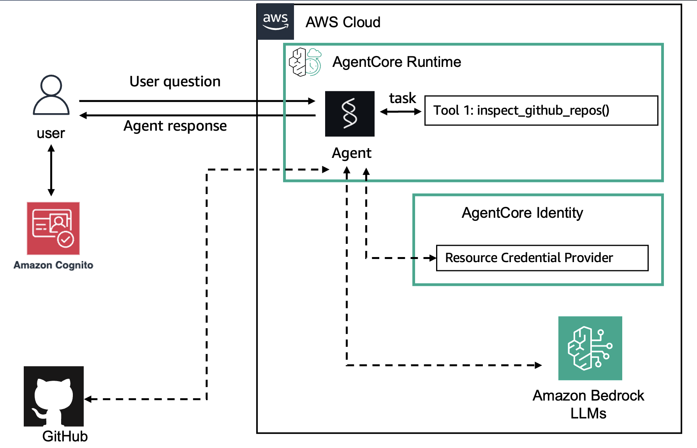

# Multi-Agent Platform - GitHub Agent

Production-ready multi-agent platform with AWS Bedrock AgentCore integration using OAuth 2.0 authentication.

## ✅ **Status: Ready for Runtime Deployment!**

Following the official AWS notebook pattern - tools use real GitHub API with `@requires_access_token` decorator.

---

## 🚀 Quick Deployment Guide

### Prerequisites

1. **GitHub OAuth App** (Device Flow enabled)
   - Create at: https://github.com/settings/developers
   - Copy Client ID and Client Secret

2. **AWS Setup**
   - AWS credentials configured (`aws configure`)
   - Bedrock AgentCore access in supported region
   - Regions: `ap-southeast-2`, `us-west-2`, `ap-southeast-2`, `eu-central-1`

3. **Dependencies**
   ```bash
   uv sync --all-extras  # Includes agentcore-starter-toolkit
   ```

### Step 1: Configure Credentials

```bash
# Copy example and add your GitHub OAuth credentials
cp .env.example .env

# Edit .env:
GITHUB_CLIENT_ID=your_github_oauth_client_id
GITHUB_CLIENT_SECRET=your_github_oauth_client_secret
AWS_REGION=ap-southeast-2
```

### Step 2: Create GitHub Credential Provider

```bash
# This creates the OAuth provider in AgentCore Identity
uv run python setup_github_provider.py
```

**Output:**
```
✅ SUCCESS! GitHub credential provider created
Provider ARN: arn:aws:bedrock-agentcore:...
```

###Step 3: Deploy to AgentCore Runtime

```bash
# Configure deployment
agentcore configure -e src/agents/github_agent/runtime.py --non-interactive

# Deploy to AWS (uses CodeBuild - no local Docker needed!)
agentcore launch

# This will:
# - Build ARM64 container via AWS CodeBuild
# - Push to ECR
# - Deploy to AgentCore Runtime
# - Set up CloudWatch logging
# - Activate endpoint
```

### Step 4: Test Your Agent

```bash
# Invoke the agent with a user ID (required for OAuth 3LO)
agentcore invoke '{"prompt": "list my repositories"}' --user-id "user-123"

# What happens:
# 1. You'll see an authorization URL in the logs
# 2. Visit the URL and authorize the GitHub app
# 3. AgentCore securely stores YOUR OAuth token (isolated per user)
# 4. The agent lists YOUR GitHub repositories!
```

**Why `--user-id` is required:**
- 3LO (Three-Legged OAuth) = "on behalf of a user"
- Each user gets their own isolated OAuth tokens
- AgentCore Identity manages token storage per user
- Your tokens are NEVER accessible to other users
- In production: Pass real user IDs from your auth system

---

## 🏗️ Architecture



**How it works:**

1. **User Invokes Agent** with their user ID
2. **AgentCore Runtime** checks for existing OAuth token for that user
3. **If no token**: Triggers OAuth Device Flow
   - User visits authorization URL
   - Authorizes the GitHub app
   - AgentCore Identity stores token (encrypted, per-user)
4. **If token exists**: Retrieves user's token from AgentCore Identity
5. **Agent Tools** use the token to call GitHub API
6. **Response** returned to the user with their data

**Key Components:**
- 🔐 **AgentCore Identity**: Manages user-specific OAuth tokens
- 🤖 **Bedrock Runtime**: Serverless agent execution environment
- 🛠️ **Tools Layer**: GitHub API integration with httpx
- 🔑 **Credential Provider**: GitHub OAuth app configuration

---

## 📁 Project Structure (Following Notebook Pattern)

```
outbound_auth_github/
├── src/
│   ├── agents/
│   │   └── github_agent/
│   │       ├── runtime.py          # ✅ BedrockAgentCoreApp entrypoint
│   │       ├── agent.py            # Agent logic (if needed)
│   │       └── __main__.py         # CLI (not used in runtime)
│   ├── tools/
│   │   └── github/
│   │       ├── repos.py            # ✅ @tool with httpx API calls
│   │       └── issues.py           # ✅ @tool with httpx API calls
│   └── common/
│       ├── auth/
│       │   ├── github.py           # ✅ @requires_access_token
│       │   └── credential_provider.py  # Provider management
│       └── config/
│           └── config.py           # Config management
├── setup_github_provider.py       # ✅ Setup script
├── pyproject.toml                  # Dependencies + tasks
└── .env                            # Your credentials
```

### Key Files (Notebook Pattern)

**`runtime.py`** - AgentCore entrypoint:
```python
from bedrock_agentcore.runtime import BedrockAgentCoreApp
from strands import Agent

app = BedrockAgentCoreApp()

agent = Agent(
    model="us.anthropic.claude-3-7-sonnet-20250219-v1:0",
    tools=[list_github_repos, ...]
)

@app.entrypoint
def strands_agent_github(payload):
    response = agent(payload.get("prompt"))
    return {"result": response.message}
```

**`tools/github/repos.py`** - Tools with real API:
```python
from common.auth.github import github_access_token

@tool
def list_github_repos() -> str:
    headers = {"Authorization": f"Bearer {github_access_token}"}
    response = httpx.get("https://api.github.com/user", headers=headers)
    # ... process and return results
```

**`common/auth/github.py`** - OAuth decorator:
```python
@requires_access_token(
    provider_name="github-provider",
    scopes=["repo", "read:user"],
    auth_flow='USER_FEDERATION',
    on_auth_url=on_auth_url,
    force_authentication=True,
)
async def get_github_access_token(*, access_token: str) -> str:
    global github_access_token
    github_access_token = access_token
    return access_token
```

---

## 🔧 Available Tools

The agent has access to:

**Repository Tools:**
- `list_github_repos` - List user's repositories with stats
- `get_repo_info` - Get detailed repository information
- `create_github_repo` - Create a new repository

**Issue Tools:**
- `list_github_issues` - List issues in a repository
- `create_github_issue` - Create a new issue
- `close_github_issue` - Close an existing issue

---

## 🧪 Local Testing (Optional)

You can test locally before deploying:

```bash
# Test locally (requires Docker)
agentcore launch --local

# Invoke locally
agentcore invoke '{"prompt": "test query"}' --local
```

---

## 🌐 OAuth Flow (User Experience)

When a user invokes the agent with `--user-id`:

1. **First Time / No Token:**
   - Agent generates user-specific authorization URL
   - User visits URL in browser and authorizes
   - AgentCore Identity stores the token **for that user only**
   - Token is encrypted and isolated per user

2. **Subsequent Calls (Same User):**
   - AgentCore automatically retrieves **that user's** token
   - No re-authorization needed
   - Works across sessions

3. **Different User:**
   - Different `--user-id` = completely separate OAuth flow
   - Each user has their own isolated tokens
   - Users can NEVER access each other's data

---

## 🔐 Security & Privacy

### 🛡️ Multi-Tenant Security (Production)
**Your data is 100% isolated and secure:**

- ✅ **User Isolation**: Each user ID gets separate OAuth tokens
- ✅ **Token Encryption**: All tokens encrypted at rest by AWS
- ✅ **Access Control**: User A can NEVER access User B's tokens
- ✅ **Automatic Expiry**: Tokens expire and refresh automatically
- ✅ **Zero Trust**: AgentCore uses workload identities (no long-lived secrets)
- ✅ **Audit Trail**: CloudWatch logs all token access

**Why this is secure:**
- AgentCore Identity uses AWS Secrets Manager + KMS encryption
- Workload identities are scoped per-user and short-lived
- IAM policies enforce strict access boundaries
- GitHub tokens only access what the user authorized

### Production Deployment
```bash
# In your application, pass real user IDs:
response = agent_core_client.invoke_agent_runtime(
    agentRuntimeArn=agent_arn,
    runtimeSessionId=f"user-{user_id}-session-{session_id}",
    runtimeUserId=user_id,  # From your auth system (Cognito, Auth0, etc.)
    payload={"prompt": "list my repositories"}
)
```

### Local Development (.env file)
```bash
GITHUB_CLIENT_ID=your_oauth_client_id
GITHUB_CLIENT_SECRET=your_oauth_client_secret
AWS_REGION=ap-southeast-2  # or ap-southeast-2, us-west-2, eu-central-1
```

---

## 📊 Monitoring

### CloudWatch Logs
```bash
# View logs
aws logs tail /aws/bedrock-agentcore/runtime/github-agent --follow
```

### Agent Status
```bash
# Check deployment status
agentcore status --agent github-agent
```

---

## 🔄 Updates & Redeployment

To update the agent:

```bash
# Make code changes, then:
agentcore launch

# This rebuilds and redeploys automatically
```

---

## 🎯 Example Queries

Once deployed, users can ask:

```bash
agentcore invoke '{"prompt": "list my repositories"}' --user-id "alice"
agentcore invoke '{"prompt": "create a repository called my-new-project"}' --user-id "alice"
agentcore invoke '{"prompt": "show me issues in my awesome-project repo"}' --user-id "bob"
agentcore invoke '{"prompt": "create an issue about fixing the bug in login flow"}' --user-id "bob"
```

---

## 🚀 What You Can Build With This Template

This isn't just a GitHub agent - it's a **production-ready multi-agent platform** for OAuth-powered AI assistants!

### 💡 Real-World Applications

**Developer Productivity Suite**
```
🤖 GitHub Agent → Manage code, issues, PRs
🤖 Jira Agent → Track sprints, create tickets
🤖 Slack Agent → Send notifications, manage channels
🤖 Confluence Agent → Update documentation
```

**Customer Support Platform**
```
🤖 Zendesk Agent → Handle support tickets
🤖 Salesforce Agent → Update CRM records
🤖 Gmail Agent → Send personalized responses
🤖 Calendar Agent → Schedule follow-ups
```

**Marketing Automation**
```
🤖 HubSpot Agent → Manage campaigns
🤖 Twitter Agent → Schedule posts
🤖 LinkedIn Agent → Engage with network
🤖 Analytics Agent → Generate reports
```

### 🎨 Why This Template Is Special

✨ **Multi-Tenant by Design** - Each user has isolated OAuth tokens, scale to millions safely

🔐 **OAuth 3LO Pattern** - Users authorize once, tokens stored securely, works with ANY OAuth 2.0 provider

🏗️ **Production-Ready** - Serverless, auto-scaling, pay-per-use

📚 **AWS Best Practices** - Follows official patterns, battle-tested

### 🔧 Adding More Agents (5 Minutes!)

```bash
# 1. Copy template
cp -r src/agents/github_agent src/agents/jira_agent

# 2. Create tools (src/tools/jira/*.py)
# 3. Create OAuth provider (like setup_github_provider.py)
# 4. Deploy!

agentcore configure -e src/agents/jira_agent/runtime.py
agentcore launch
```

### 🌟 Built With This Template

- 📝 AI issue triage (saves 10 hours/week)
- 🤝 Automated PR reviewer (catches bugs early)
- 📊 Daily standup reports (GitHub + Jira sync)
- 🔔 Smart notifications (filters important updates)
- 📈 Engineering metrics (commits, PRs, velocity)

**What will YOU build?**

---

## 🚧 Troubleshooting

### "Credential provider not found"
```bash
# Run setup again
uv run python setup_github_provider.py
```

### "No access to Bedrock AgentCore"
- Check your AWS region (must be: ap-southeast-2, us-west-2, ap-southeast-2, eu-central-1)
- Verify IAM permissions for bedrock-agentcore

### "OAuth authorization failed"
- Check GitHub OAuth App settings
- Verify Client ID/Secret in .env
- Ensure Device Flow is enabled

---

## 📚 Documentation

- **AWS Notebook**: [runtime_with_strands_and_egress_github_3lo.ipynb](https://github.com/awslabs/amazon-bedrock-agentcore-samples/blob/main/01-tutorials/03-AgentCore-identity/06-Outbound_Auth_Github/runtime_with_strands_and_egress_github_3lo.ipynb)
- **AgentCore Docs**: https://docs.aws.amazon.com/bedrock-agentcore/
- **Strands Framework**: https://strandsagents.com/

---

## 🏗️ Adding More Agents

This structure supports multiple agents:

```bash
# Copy template
cp -r src/agents/github_agent src/agents/jira_agent

# Create tools
mkdir src/tools/jira
# ... implement tools

# Deploy separately
agentcore configure -e src/agents/jira_agent/runtime.py
agentcore launch
```

---

## Tech Stack

- **Framework**: Strands Agents
- **Runtime**: AWS Bedrock AgentCore
- **Model**: Claude 3.7 Sonnet
- **OAuth**: AgentCore Identity (3LO)
- **HTTP**: httpx
- **Package Manager**: uv
- **Deployment**: agentcore CLI

---

**Status**: ✅ Production-ready, following official AWS notebook pattern!
