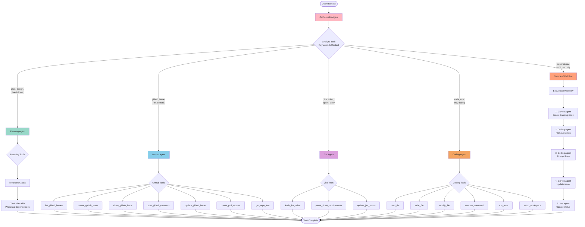

```mermaid
flowchart TB
    Start([User Request]) --> Orchestrator[Orchestrator Agent]

    Orchestrator --> Analysis{Analyze Task<br/>Keywords & Context}

    Analysis -->|plan, design,<br/>breakdown| Planning[Planning Agent]
    Analysis -->|github, issue,<br/>PR, commit| GitHub[GitHub Agent]
    Analysis -->|jira, ticket,<br/>sprint, story| Jira[Jira Agent]
    Analysis -->|code, run,<br/>test, debug| Coding[Coding Agent]
    Analysis -->|dependency,<br/>audit, security| Complex[Complex Workflow]

    Planning --> PlanningTools{Planning Tools}
    PlanningTools --> T1[breakdown_task]
    T1 --> Result1[Task Plan with<br/>Phases & Dependencies]

    GitHub --> GitHubTools{GitHub Tools}
    GitHubTools --> T2[list_github_issues]
    GitHubTools --> T3[create_github_issue]
    GitHubTools --> T4[close_github_issue]
    GitHubTools --> T5[post_github_comment]
    GitHubTools --> T6[update_github_issue]
    GitHubTools --> T7[create_pull_request]
    GitHubTools --> T8[get_repo_info]

    Jira --> JiraTools{Jira Tools}
    JiraTools --> T9[fetch_jira_ticket]
    JiraTools --> T10[parse_ticket_requirements]
    JiraTools --> T11[update_jira_status]

    Coding --> CodingTools{Coding Tools}
    CodingTools --> T12[read_file]
    CodingTools --> T13[write_file]
    CodingTools --> T14[modify_file]
    CodingTools --> T15[execute_command]
    CodingTools --> T16[run_tests]
    CodingTools --> T17[setup_workspace]

    Complex --> Workflow[Sequential Workflow]
    Workflow --> Step1[1. GitHub Agent<br/>Create tracking issue]
    Step1 --> Step2[2. Coding Agent<br/>Run audit/tests]
    Step2 --> Step3[3. Coding Agent<br/>Attempt fixes]
    Step3 --> Step4[4. GitHub Agent<br/>Update issue]
    Step4 --> Step5[5. Jira Agent<br/>Update status]

    Result1 --> End([Task Complete])
    T2 --> End
    T3 --> End
    T4 --> End
    T5 --> End
    T6 --> End
    T7 --> End
    T8 --> End
    T9 --> End
    T10 --> End
    T11 --> End
    T12 --> End
    T13 --> End
    T14 --> End
    T15 --> End
    T16 --> End
    T17 --> End
    Step5 --> End

    style Orchestrator fill:#ffb6c1
    style Planning fill:#98d8c8
    style GitHub fill:#87ceeb
    style Jira fill:#dda0dd
    style Coding fill:#f4a460
    style Complex fill:#ffa07a
```
