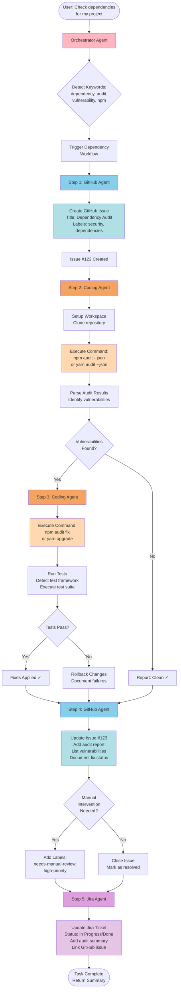

```mermaid
flowchart TD
    Start([User: Check dependencies<br/>for my project]) --> Orchestrator[Orchestrator Agent]

    Orchestrator --> Detect{Detect Keywords:<br/>dependency, audit,<br/>vulnerability, npm}

    Detect --> Workflow[Trigger Dependency<br/>Workflow]

    Workflow --> S1[Step 1: GitHub Agent]
    S1 --> CreateIssue[Create GitHub Issue<br/>Title: Dependency Audit<br/>Labels: security, dependencies]
    CreateIssue --> IssueCreated[Issue #123 Created]

    IssueCreated --> S2[Step 2: Coding Agent]
    S2 --> SetupWS[Setup Workspace<br/>Clone repository]
    SetupWS --> RunAudit[Execute Command:<br/>npm audit --json<br/>or yarn audit --json]
    RunAudit --> ParseResults[Parse Audit Results<br/>Identify vulnerabilities]

    ParseResults --> HasVulns{Vulnerabilities<br/>Found?}

    HasVulns -->|No| NoVulns[Report: Clean ✓]
    HasVulns -->|Yes| S3[Step 3: Coding Agent]

    S3 --> AttemptFix[Execute Command:<br/>npm audit fix<br/>or yarn upgrade]
    AttemptFix --> RunTests[Run Tests<br/>Detect test framework<br/>Execute test suite]
    RunTests --> TestPass{Tests Pass?}

    TestPass -->|Yes| Fixed[Fixes Applied ✓]
    TestPass -->|No| Rollback[Rollback Changes<br/>Document failures]

    Fixed --> S4[Step 4: GitHub Agent]
    Rollback --> S4
    NoVulns --> S4

    S4 --> UpdateIssue[Update Issue #123<br/>Add audit report<br/>List vulnerabilities<br/>Document fix status]

    UpdateIssue --> NeedManual{Manual<br/>Intervention<br/>Needed?}

    NeedManual -->|Yes| AddLabels[Add Labels:<br/>needs-manual-review,<br/>high-priority]
    NeedManual -->|No| CloseIssue[Close Issue<br/>Mark as resolved]

    AddLabels --> S5[Step 5: Jira Agent]
    CloseIssue --> S5

    S5 --> UpdateJira[Update Jira Ticket<br/>Status: In Progress/Done<br/>Add audit summary<br/>Link GitHub issue]

    UpdateJira --> End([Task Complete<br/>Return Summary])

    style Orchestrator fill:#ffb6c1
    style S1 fill:#87ceeb
    style S2 fill:#f4a460
    style S3 fill:#f4a460
    style S4 fill:#87ceeb
    style S5 fill:#dda0dd
    style CreateIssue fill:#b0e0e6
    style RunAudit fill:#ffd8b1
    style AttemptFix fill:#ffd8b1
    style UpdateIssue fill:#b0e0e6
    style UpdateJira fill:#e6c4e6
```
