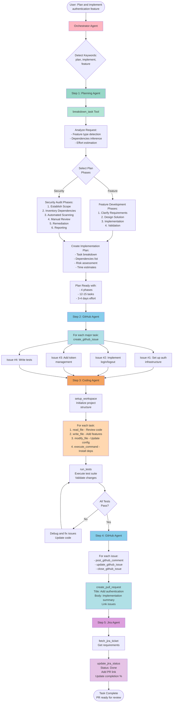

```mermaid
flowchart TD
    Start([User: Plan and implement<br/>authentication feature]) --> Orchestrator[Orchestrator Agent]
    
    Orchestrator --> Detect{Detect Keywords:<br/>plan, implement,<br/>feature}
    
    Detect --> S1[Step 1: Planning Agent]
    
    S1 --> Breakdown[breakdown_task Tool]
    Breakdown --> Analysis[Analyze Request:<br/>- Feature type detection<br/>- Dependencies inference<br/>- Effort estimation]
    
    Analysis --> SelectPhases{Select Plan<br/>Phases}
    
    SelectPhases -->|Feature| FeaturePhases[Feature Development Phases:<br/>1. Clarify Requirements<br/>2. Design Solution<br/>3. Implementation<br/>4. Validation]
    
    SelectPhases -->|Security| SecurityPhases[Security Audit Phases:<br/>1. Establish Scope<br/>2. Inventory Dependencies<br/>3. Automated Scanning<br/>4. Manual Review<br/>5. Remediation<br/>6. Reporting]
    
    FeaturePhases --> CreatePlan[Create Implementation Plan:<br/>- Task breakdown<br/>- Dependencies list<br/>- Risk assessment<br/>- Time estimates]
    
    SecurityPhases --> CreatePlan
    
    CreatePlan --> PlanReady[Plan Ready with:<br/>- 4 phases<br/>- 12-15 tasks<br/>- 3-4 days effort]
    
    PlanReady --> S2[Step 2: GitHub Agent]
    
    S2 --> CreateIssues[For each major task:<br/>create_github_issue]
    
    CreateIssues --> Issue1[Issue #1: Set up auth<br/>infrastructure]
    CreateIssues --> Issue2[Issue #2: Implement<br/>login/logout]
    CreateIssues --> Issue3[Issue #3: Add token<br/>management]
    CreateIssues --> Issue4[Issue #4: Write tests]
    
    Issue1 --> S3[Step 3: Coding Agent]
    Issue2 --> S3
    Issue3 --> S3
    Issue4 --> S3
    
    S3 --> WorkspaceSetup[setup_workspace<br/>Initialize project<br/>structure]
    
    WorkspaceSetup --> Implementation[For each task:<br/>1. read_file - Review code<br/>2. write_file - Add features<br/>3. modify_file - Update config<br/>4. execute_command - Install deps]
    
    Implementation --> RunTests[run_tests<br/>Execute test suite<br/>Validate changes]
    
    RunTests --> TestResults{All Tests<br/>Pass?}
    
    TestResults -->|No| Debug[Debug and fix issues<br/>Update code]
    Debug --> RunTests
    
    TestResults -->|Yes| S4[Step 4: GitHub Agent]
    
    S4 --> UpdateIssues[For each issue:<br/>- post_github_comment<br/>- update_github_issue<br/>- close_github_issue]
    
    UpdateIssues --> CreatePR[create_pull_request<br/>Title: Add authentication<br/>Body: Implementation summary<br/>Link issues]
    
    CreatePR --> S5[Step 5: Jira Agent]
    
    S5 --> FetchTicket[fetch_jira_ticket<br/>Get requirements]
    FetchTicket --> UpdateStatus[update_jira_status<br/>Status: Done<br/>Add PR link<br/>Update completion %]
    
    UpdateStatus --> End([Task Complete<br/>PR ready for review])
    
    style Orchestrator fill:#ffb6c1
    style S1 fill:#98d8c8
    style S2 fill:#87ceeb
    style S3 fill:#f4a460
    style S4 fill:#87ceeb
    style S5 fill:#dda0dd
    style Breakdown fill:#b3e6d5
    style CreateIssues fill:#b0e0e6
    style Implementation fill:#ffd8b1
    style CreatePR fill:#b0e0e6
    style UpdateStatus fill:#e6c4e6
```
