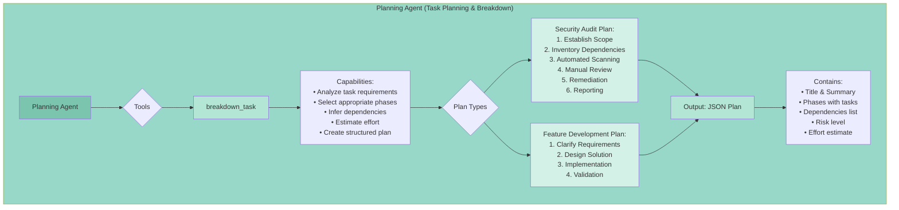

```mermaid
flowchart TB
    subgraph Planning["Planning Agent (Task Planning & Breakdown)"]
        PA[Planning Agent] --> PT{Tools}
        PT --> PT1[breakdown_task]
        
        PT1 --> Features[Capabilities:<br/>• Analyze task requirements<br/>• Select appropriate phases<br/>• Infer dependencies<br/>• Estimate effort<br/>• Create structured plan]
        
        Features --> Phases{Plan Types}
        
        Phases --> Security[Security Audit Plan:<br/>1. Establish Scope<br/>2. Inventory Dependencies<br/>3. Automated Scanning<br/>4. Manual Review<br/>5. Remediation<br/>6. Reporting]
        
        Phases --> Feature[Feature Development Plan:<br/>1. Clarify Requirements<br/>2. Design Solution<br/>3. Implementation<br/>4. Validation]
        
        Security --> Output1[Output: JSON Plan]
        Feature --> Output1
        Output1 --> Details[Contains:<br/>• Title & Summary<br/>• Phases with tasks<br/>• Dependencies list<br/>• Risk level<br/>• Effort estimate]
    end
    
    style Planning fill:#98d8c8
    style PA fill:#7bc5ae
    style PT1 fill:#b3e6d5
    style Security fill:#d4f1e8
    style Feature fill:#d4f1e8
    style Output1 fill:#b3e6d5
```
