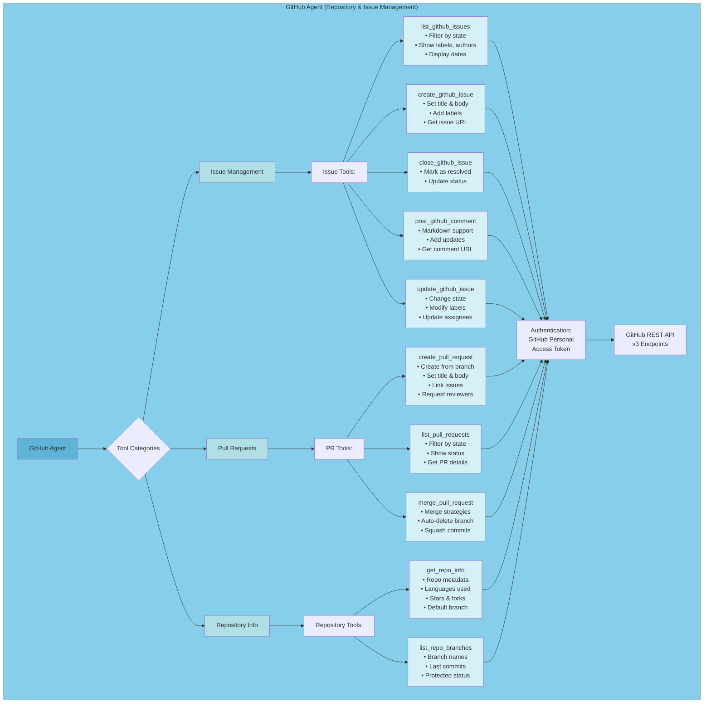

```mermaid
flowchart TB
    subgraph GitHub["GitHub Agent (Repository & Issue Management)"]
        GA[GitHub Agent] --> GT{Tool Categories}
        
        GT --> Issues[Issue Management]
        GT --> PRs[Pull Requests]
        GT --> Repos[Repository Info]
        
        Issues --> IssueTools[Issue Tools:]
        IssueTools --> I1[list_github_issues<br/>• Filter by state<br/>• Show labels, authors<br/>• Display dates]
        
        IssueTools --> I2[create_github_issue<br/>• Set title & body<br/>• Add labels<br/>• Get issue URL]
        
        IssueTools --> I3[close_github_issue<br/>• Mark as resolved<br/>• Update status]
        
        IssueTools --> I4[post_github_comment<br/>• Markdown support<br/>• Add updates<br/>• Get comment URL]
        
        IssueTools --> I5[update_github_issue<br/>• Change state<br/>• Modify labels<br/>• Update assignees]
        
        PRs --> PRTools[PR Tools:]
        PRTools --> P1[create_pull_request<br/>• Create from branch<br/>• Set title & body<br/>• Link issues<br/>• Request reviewers]
        
        PRTools --> P2[list_pull_requests<br/>• Filter by state<br/>• Show status<br/>• Get PR details]
        
        PRTools --> P3[merge_pull_request<br/>• Merge strategies<br/>• Auto-delete branch<br/>• Squash commits]
        
        Repos --> RepoTools[Repository Tools:]
        RepoTools --> R1[get_repo_info<br/>• Repo metadata<br/>• Languages used<br/>• Stars & forks<br/>• Default branch]
        
        RepoTools --> R2[list_repo_branches<br/>• Branch names<br/>• Last commits<br/>• Protected status]
        
        I1 --> Auth[Authentication:<br/>GitHub Personal<br/>Access Token]
        I2 --> Auth
        I3 --> Auth
        I4 --> Auth
        I5 --> Auth
        P1 --> Auth
        P2 --> Auth
        P3 --> Auth
        R1 --> Auth
        R2 --> Auth
        
        Auth --> API[GitHub REST API<br/>v3 Endpoints]
    end
    
    style GitHub fill:#87ceeb
    style GA fill:#5eb3d6
    style Issues fill:#b0e0e6
    style PRs fill:#b0e0e6
    style Repos fill:#b0e0e6
    style I1 fill:#d5f0f7
    style I2 fill:#d5f0f7
    style I3 fill:#d5f0f7
    style I4 fill:#d5f0f7
    style I5 fill:#d5f0f7
    style P1 fill:#d5f0f7
    style P2 fill:#d5f0f7
    style P3 fill:#d5f0f7
    style R1 fill:#d5f0f7
    style R2 fill:#d5f0f7
```
