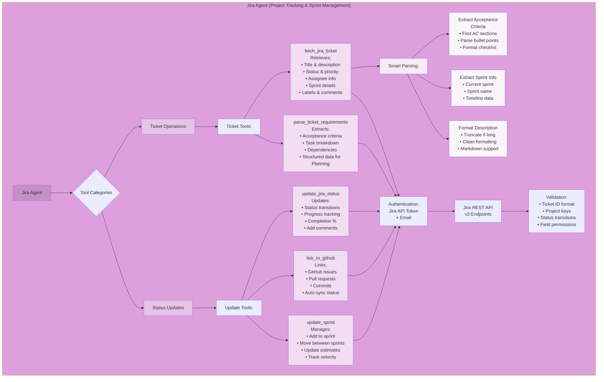

```mermaid
flowchart TB
    subgraph Jira["Jira Agent (Project Tracking & Sprint Management)"]
        JA[Jira Agent] --> JT{Tool Categories}
        
        JT --> Tickets[Ticket Operations]
        JT --> Updates[Status Updates]
        
        Tickets --> TicketTools[Ticket Tools:]
        TicketTools --> T1[fetch_jira_ticket<br/>Retrieves:<br/>• Title & description<br/>• Status & priority<br/>• Assignee info<br/>• Sprint details<br/>• Labels & comments]
        
        TicketTools --> T2[parse_ticket_requirements<br/>Extracts:<br/>• Acceptance criteria<br/>• Task breakdown<br/>• Dependencies<br/>• Structured data for Planning]
        
        T1 --> Parsing[Smart Parsing:]
        Parsing --> P1[Extract Acceptance<br/>Criteria<br/>• Find AC sections<br/>• Parse bullet points<br/>• Format checklist]
        
        Parsing --> P2[Extract Sprint Info<br/>• Current sprint<br/>• Sprint name<br/>• Timeline data]
        
        Parsing --> P3[Format Description<br/>• Truncate if long<br/>• Clean formatting<br/>• Markdown support]
        
        Updates --> UpdateTools[Update Tools:]
        UpdateTools --> U1[update_jira_status<br/>Updates:<br/>• Status transitions<br/>• Progress tracking<br/>• Completion %<br/>• Add comments]
        
        UpdateTools --> U2[link_to_github<br/>Links:<br/>• GitHub issues<br/>• Pull requests<br/>• Commits<br/>• Auto-sync status]
        
        UpdateTools --> U3[update_sprint<br/>Manages:<br/>• Add to sprint<br/>• Move between sprints<br/>• Update estimates<br/>• Track velocity]
        
        T1 --> Auth[Authentication:<br/>Jira API Token<br/>+ Email]
        T2 --> Auth
        U1 --> Auth
        U2 --> Auth
        U3 --> Auth
        
        Auth --> API[Jira REST API<br/>v3 Endpoints]
        
        API --> Validation[Validation:<br/>• Ticket ID format<br/>• Project keys<br/>• Status transitions<br/>• Field permissions]
    end
    
    style Jira fill:#dda0dd
    style JA fill:#c78ec7
    style Tickets fill:#e6c4e6
    style Updates fill:#e6c4e6
    style T1 fill:#f2ddf2
    style T2 fill:#f2ddf2
    style U1 fill:#f2ddf2
    style U2 fill:#f2ddf2
    style U3 fill:#f2ddf2
    style Parsing fill:#f7ebf7
    style P1 fill:#faf5fa
    style P2 fill:#faf5fa
    style P3 fill:#faf5fa
```
