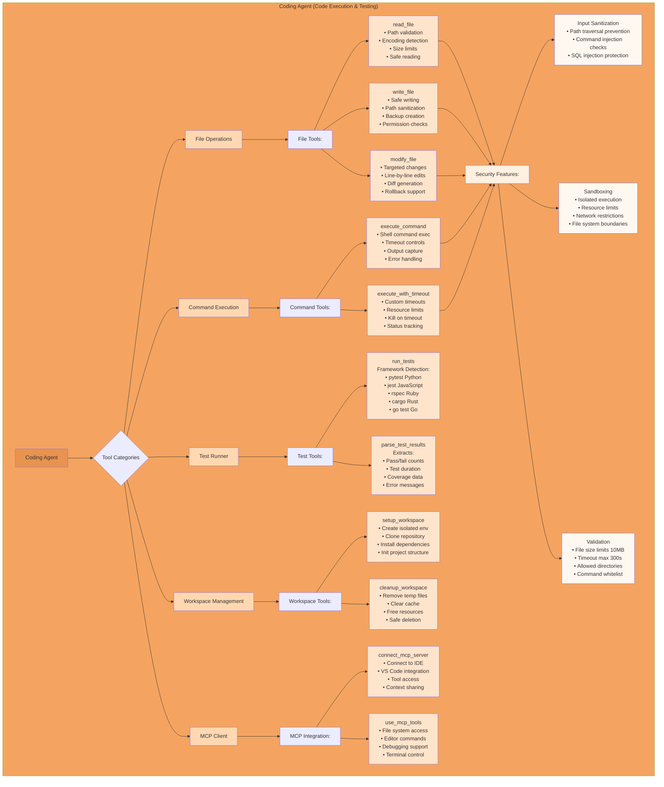

```mermaid
flowchart TB
    subgraph Coding["Coding Agent (Code Execution & Testing)"]
        CA[Coding Agent] --> CT{Tool Categories}
        
        CT --> Files[File Operations]
        CT --> Commands[Command Execution]
        CT --> Tests[Test Runner]
        CT --> Workspace[Workspace Management]
        CT --> MCP[MCP Client]
        
        Files --> FileTools[File Tools:]
        FileTools --> F1[read_file<br/>• Path validation<br/>• Encoding detection<br/>• Size limits<br/>• Safe reading]
        
        FileTools --> F2[write_file<br/>• Safe writing<br/>• Path sanitization<br/>• Backup creation<br/>• Permission checks]
        
        FileTools --> F3[modify_file<br/>• Targeted changes<br/>• Line-by-line edits<br/>• Diff generation<br/>• Rollback support]
        
        Commands --> CmdTools[Command Tools:]
        CmdTools --> C1[execute_command<br/>• Shell command exec<br/>• Timeout controls<br/>• Output capture<br/>• Error handling]
        
        CmdTools --> C2[execute_with_timeout<br/>• Custom timeouts<br/>• Resource limits<br/>• Kill on timeout<br/>• Status tracking]
        
        Tests --> TestTools[Test Tools:]
        TestTools --> TR1[run_tests<br/>Framework Detection:<br/>• pytest Python<br/>• jest JavaScript<br/>• rspec Ruby<br/>• cargo Rust<br/>• go test Go]
        
        TestTools --> TR2[parse_test_results<br/>Extracts:<br/>• Pass/fail counts<br/>• Test duration<br/>• Coverage data<br/>• Error messages]
        
        Workspace --> WSTools[Workspace Tools:]
        WSTools --> W1[setup_workspace<br/>• Create isolated env<br/>• Clone repository<br/>• Install dependencies<br/>• Init project structure]
        
        WSTools --> W2[cleanup_workspace<br/>• Remove temp files<br/>• Clear cache<br/>• Free resources<br/>• Safe deletion]
        
        MCP --> MCPTools[MCP Integration:]
        MCPTools --> M1[connect_mcp_server<br/>• Connect to IDE<br/>• VS Code integration<br/>• Tool access<br/>• Context sharing]
        
        MCPTools --> M2[use_mcp_tools<br/>• File system access<br/>• Editor commands<br/>• Debugging support<br/>• Terminal control]
        
        F1 --> Security[Security Features:]
        F2 --> Security
        F3 --> Security
        C1 --> Security
        C2 --> Security
        
        Security --> S1[Input Sanitization<br/>• Path traversal prevention<br/>• Command injection checks<br/>• SQL injection protection]
        
        Security --> S2[Sandboxing<br/>• Isolated execution<br/>• Resource limits<br/>• Network restrictions<br/>• File system boundaries]
        
        Security --> S3[Validation<br/>• File size limits 10MB<br/>• Timeout max 300s<br/>• Allowed directories<br/>• Command whitelist]
    end
    
    style Coding fill:#f4a460
    style CA fill:#e89350
    style Files fill:#ffd8b1
    style Commands fill:#ffd8b1
    style Tests fill:#ffd8b1
    style Workspace fill:#ffd8b1
    style MCP fill:#ffd8b1
    style F1 fill:#ffe4cc
    style F2 fill:#ffe4cc
    style F3 fill:#ffe4cc
    style C1 fill:#ffe4cc
    style C2 fill:#ffe4cc
    style TR1 fill:#ffe4cc
    style TR2 fill:#ffe4cc
    style W1 fill:#ffe4cc
    style W2 fill:#ffe4cc
    style M1 fill:#ffe4cc
    style M2 fill:#ffe4cc
    style Security fill:#fff0e0
    style S1 fill:#fff8f0
    style S2 fill:#fff8f0
    style S3 fill:#fff8f0
```
