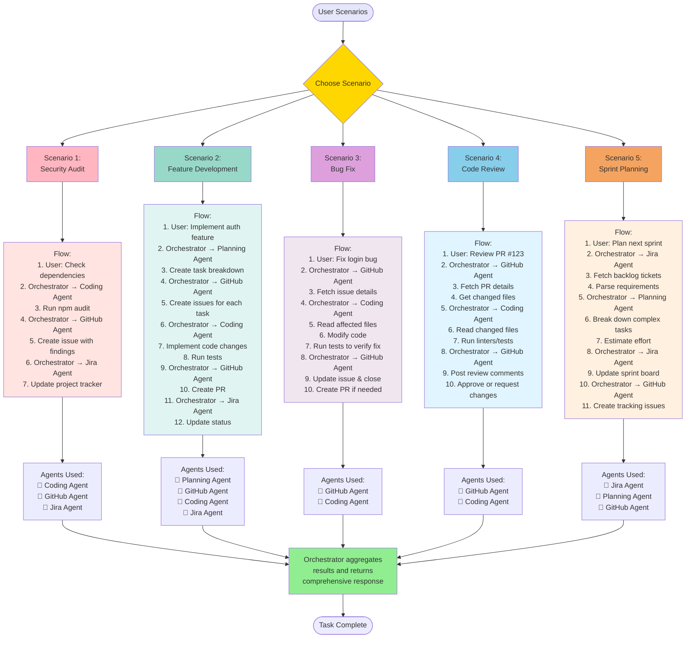

```mermaid
flowchart TB
    Start([User Scenarios]) --> Scenarios{Choose Scenario}
    
    Scenarios --> S1[Scenario 1:<br/>Security Audit]
    Scenarios --> S2[Scenario 2:<br/>Feature Development]
    Scenarios --> S3[Scenario 3:<br/>Bug Fix]
    Scenarios --> S4[Scenario 4:<br/>Code Review]
    Scenarios --> S5[Scenario 5:<br/>Sprint Planning]
    
    S1 --> S1Flow[Flow:<br/>1. User: Check dependencies<br/>2. Orchestrator → Coding Agent<br/>3. Run npm audit<br/>4. Orchestrator → GitHub Agent<br/>5. Create issue with findings<br/>6. Orchestrator → Jira Agent<br/>7. Update project tracker]
    
    S2 --> S2Flow[Flow:<br/>1. User: Implement auth feature<br/>2. Orchestrator → Planning Agent<br/>3. Create task breakdown<br/>4. Orchestrator → GitHub Agent<br/>5. Create issues for each task<br/>6. Orchestrator → Coding Agent<br/>7. Implement code changes<br/>8. Run tests<br/>9. Orchestrator → GitHub Agent<br/>10. Create PR<br/>11. Orchestrator → Jira Agent<br/>12. Update status]
    
    S3 --> S3Flow[Flow:<br/>1. User: Fix login bug<br/>2. Orchestrator → GitHub Agent<br/>3. Fetch issue details<br/>4. Orchestrator → Coding Agent<br/>5. Read affected files<br/>6. Modify code<br/>7. Run tests to verify fix<br/>8. Orchestrator → GitHub Agent<br/>9. Update issue & close<br/>10. Create PR if needed]
    
    S4 --> S4Flow[Flow:<br/>1. User: Review PR #123<br/>2. Orchestrator → GitHub Agent<br/>3. Fetch PR details<br/>4. Get changed files<br/>5. Orchestrator → Coding Agent<br/>6. Read changed files<br/>7. Run linters/tests<br/>8. Orchestrator → GitHub Agent<br/>9. Post review comments<br/>10. Approve or request changes]
    
    S5 --> S5Flow[Flow:<br/>1. User: Plan next sprint<br/>2. Orchestrator → Jira Agent<br/>3. Fetch backlog tickets<br/>4. Parse requirements<br/>5. Orchestrator → Planning Agent<br/>6. Break down complex tasks<br/>7. Estimate effort<br/>8. Orchestrator → Jira Agent<br/>9. Update sprint board<br/>10. Orchestrator → GitHub Agent<br/>11. Create tracking issues]
    
    S1Flow --> Agents1[Agents Used:<br/>🔸 Coding Agent<br/>🔸 GitHub Agent<br/>🔸 Jira Agent]
    
    S2Flow --> Agents2[Agents Used:<br/>🔸 Planning Agent<br/>🔸 GitHub Agent<br/>🔸 Coding Agent<br/>🔸 Jira Agent]
    
    S3Flow --> Agents3[Agents Used:<br/>🔸 GitHub Agent<br/>🔸 Coding Agent]
    
    S4Flow --> Agents4[Agents Used:<br/>🔸 GitHub Agent<br/>🔸 Coding Agent]
    
    S5Flow --> Agents5[Agents Used:<br/>🔸 Jira Agent<br/>🔸 Planning Agent<br/>🔸 GitHub Agent]
    
    Agents1 --> Result[Orchestrator aggregates<br/>results and returns<br/>comprehensive response]
    Agents2 --> Result
    Agents3 --> Result
    Agents4 --> Result
    Agents5 --> Result
    
    Result --> End([Task Complete])
    
    style Start fill:#e6e6fa
    style Scenarios fill:#ffd700
    style S1 fill:#ffb6c1
    style S2 fill:#98d8c8
    style S3 fill:#dda0dd
    style S4 fill:#87ceeb
    style S5 fill:#f4a460
    style S1Flow fill:#ffe4e1
    style S2Flow fill:#e0f5f1
    style S3Flow fill:#f0e6f0
    style S4Flow fill:#e0f5ff
    style S5Flow fill:#fff0e0
    style Result fill:#90ee90
```
