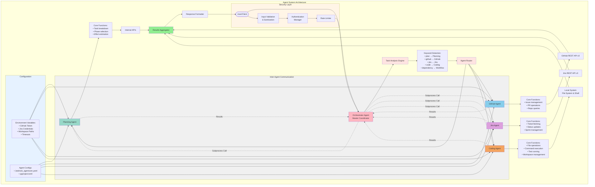

```mermaid
flowchart TB
    subgraph Architecture["Agent System Architecture"]
        User([User/Client]) --> Orchestrator[Orchestrator Agent<br/>Master Coordinator]
        
        Orchestrator --> Analysis[Task Analysis Engine]
        Analysis --> KeywordDetection[Keyword Detection:<br/>• plan → Planning<br/>• github → GitHub<br/>• jira → Jira<br/>• code → Coding<br/>• dependency → Workflow]
        
        KeywordDetection --> Router[Agent Router]
        
        Router --> Planning[Planning Agent]
        Router --> GitHub[GitHub Agent]
        Router --> Jira[Jira Agent]
        Router --> Coding[Coding Agent]
        
        Planning --> PlanningCore[Core Functions:<br/>• Task breakdown<br/>• Phase selection<br/>• Effort estimation]
        
        GitHub --> GitHubCore[Core Functions:<br/>• Issue management<br/>• PR operations<br/>• Repo queries]
        
        Jira --> JiraCore[Core Functions:<br/>• Ticket fetching<br/>• Status updates<br/>• Sprint management]
        
        Coding --> CodingCore[Core Functions:<br/>• File operations<br/>• Command execution<br/>• Test running<br/>• Workspace management]
        
        PlanningCore --> APIs1[Internal APIs]
        GitHubCore --> APIs2[GitHub REST API v3]
        JiraCore --> APIs3[Jira REST API v3]
        CodingCore --> APIs4[Local System<br/>File System & Shell]
        
        APIs1 --> Results[Results Aggregator]
        APIs2 --> Results
        APIs3 --> Results
        APIs4 --> Results
        
        Results --> ResponseFormatter[Response Formatter]
        ResponseFormatter --> User
        
        subgraph Communication["Inter-Agent Communication"]
            Orchestrator -.Subprocess Call.-> Planning
            Orchestrator -.Subprocess Call.-> GitHub
            Orchestrator -.Subprocess Call.-> Jira
            Orchestrator -.Subprocess Call.-> Coding
            
            Planning -.Results.-> Orchestrator
            GitHub -.Results.-> Orchestrator
            Jira -.Results.-> Orchestrator
            Coding -.Results.-> Orchestrator
        end
        
        subgraph Security["Security Layer"]
            InputValidation[Input Validation<br/>& Sanitization]
            AuthManager[Authentication<br/>Manager]
            RateLimiter[Rate Limiter]
            
            User --> InputValidation
            InputValidation --> AuthManager
            AuthManager --> RateLimiter
            RateLimiter --> Orchestrator
        end
        
        subgraph Config["Configuration"]
            EnvVars[Environment Variables:<br/>• GitHub Token<br/>• Jira Credentials<br/>• Workspace Paths<br/>• Timeouts]
            
            AgentConfigs[Agent Configs:<br/>• .bedrock_agentcore.yaml<br/>• pyproject.toml]
            
            EnvVars --> Planning
            EnvVars --> GitHub
            EnvVars --> Jira
            EnvVars --> Coding
            
            AgentConfigs --> Planning
            AgentConfigs --> GitHub
            AgentConfigs --> Jira
            AgentConfigs --> Coding
        end
    end
    
    style Orchestrator fill:#ffb6c1
    style Planning fill:#98d8c8
    style GitHub fill:#87ceeb
    style Jira fill:#dda0dd
    style Coding fill:#f4a460
    style Analysis fill:#ffe4e1
    style Router fill:#ffe4e1
    style Results fill:#90ee90
    style Communication fill:#f0f0f0
    style Security fill:#fff5e6
    style Config fill:#e6f2ff
```
