# Multi-Agent System Workflow

This document contains Mermaid flowcharts visualizing the complete multi-agent system architecture and workflows.

---

## 🎯 Complete System Flow


---

## 🔄 Orchestrator Agent Flow

```mermaid
graph TB
    Start([User Request]) --> Parse[Parse Request]
    Parse --> InitContext[Initialize Context]
    
    InitContext --> Step1[Step 1: JIRA Agent]
    Step1 --> JIRA1{Success?}
    JIRA1 --> |Yes| Context1[Update Context<br/>with Ticket Data]
    JIRA1 --> |No| Retry1{Retry < 3?}
    Retry1 --> |Yes| Step1
    Retry1 --> |No| Fail1([❌ JIRA Failed])
    
    Context1 --> Step2[Step 2: Planning Agent]
    Step2 --> Plan1{Success?}
    Plan1 --> |Yes| Context2[Update Context<br/>with Plan]
    Plan1 --> |No| Retry2{Retry < 3?}
    Retry2 --> |Yes| Step2
    Retry2 --> |No| Fail2([❌ Planning Failed])
    
    Context2 --> Step3[Step 3: Git Agent]
    Step3 --> Git1{Success?}
    Git1 --> |Yes| Context3[Update Context<br/>with Repo/Issue URLs]
    Git1 --> |No| Retry3{Retry < 3?}
    Retry3 --> |Yes| Step3
    Retry3 --> |No| Fail3([❌ Git Failed])
    
    Context3 --> Step4[Step 4: Coding Agent]
    Step4 --> Code1{Success?}
    Code1 --> |Yes| Context4[Update Context<br/>with PR URL]
    Code1 --> |No| Retry4{Retry < 3?}
    Retry4 --> |Yes| Step4
    Retry4 --> |No| Fail4([❌ Coding Failed])
    
    Context4 --> Step5[Step 5: Update JIRA]
    Step5 --> JIRA2{Success?}
    JIRA2 --> |Yes| Success([✅ Complete])
    JIRA2 --> |No| Retry5{Retry < 3?}
    Retry5 --> |Yes| Step5
    Retry5 --> |No| Fail5([❌ Update Failed])
    
    style Start fill:#e1f5e1
    style Success fill:#e1f5e1
    style Fail1 fill:#ffe1e1
    style Fail2 fill:#ffe1e1
    style Fail3 fill:#ffe1e1
    style Fail4 fill:#ffe1e1
    style Fail5 fill:#ffe1e1
```



---

## 📋 JIRA Agent Flow


---

## 🧠 Planning Agent Flow

```mermaid
graph TB
    Start([Planning Agent Invoked]) --> Input[Receive Requirements]
    Input --> Parse[Parse Ticket Data]
    Parse --> BuildPrompt[Build LLM Prompt]
    
    BuildPrompt --> Prompt[System Prompt:<br/>You are a technical architect...]
    Prompt --> Context[Add Context:<br/>- Ticket Title<br/>- Description<br/>- Acceptance Criteria<br/>- Tech Stack]
    
    Context --> LLM[Invoke Claude 3.5 Sonnet<br/>via Bedrock]
    LLM --> Response[Receive Plan]
    
    Response --> Validate{Validation}
    Validate --> |Missing Sections| Retry{Retry < 3?}
    Retry --> |Yes| LLM
    Retry --> |No| Error([❌ Generation Failed])
    
    Validate --> |Has Overview| Check1[✓ Overview]
    Check1 --> |Has Architecture| Check2[✓ Architecture]
    Check2 --> |Has Implementation| Check3[✓ Implementation Steps]
    Check3 --> |Has Testing| Check4[✓ Testing Strategy]
    Check4 --> |Has Timeline| Check5[✓ Timeline]
    
    Check5 --> Format[Format as Markdown]
    Format --> AddMeta[Add Metadata:<br/>- Generated Date<br/>- Ticket ID<br/>- Version]
    AddMeta --> Return([✅ Plan Document])
    
    style Start fill:#e1f5e1
    style Return fill:#e1f5e1
    style Error fill:#ffe1e1
    style LLM fill:#ffe1f5
```



---

## 🔧 Git Agent Flow

```mermaid
graph TB
    Start([Git Agent Invoked]) --> OAuth{OAuth Token<br/>Available?}
    
    OAuth --> |No| DeviceFlow[Generate Device Code]
    DeviceFlow --> ShowURL[Display Authorization URL]
    ShowURL --> Poll[Poll for Token]
    Poll --> TokenReady{User<br/>Authorized?}
    TokenReady --> |No| Timeout{Timeout?}
    Timeout --> |No| Poll
    Timeout --> |Yes| Error1([❌ Auth Timeout])
    TokenReady --> |Yes| StoreToken[Store Token in<br/>AgentCore Identity]
    
    OAuth --> |Yes| Action{Action Type}
    StoreToken --> Action
    
    Action --> |create_repo| CreateRepo[POST /user/repos]
    CreateRepo --> RepoStatus{Status 201?}
    RepoStatus --> |No| Error2([❌ Repo Failed])
    RepoStatus --> |Yes| Return1([✅ Repo Created])
    
    Action --> |create_issue| CreateIssue[POST /repos/owner/repo/issues]
    CreateIssue --> IssueStatus{Status 201?}
    IssueStatus --> |No| Error3([❌ Issue Failed])
    IssueStatus --> |Yes| Return2([✅ Issue Created])
    
    Action --> |git_operations| Clone[GitPython: Clone]
    Clone --> Branch[Create Branch]
    Branch --> Commit[Commit Changes]
    Commit --> Push[Push to Remote]
    Push --> PushStatus{Success?}
    PushStatus --> |No| Error4([❌ Push Failed])
    PushStatus --> |Yes| Return3([✅ Changes Pushed])
    
    Action --> |create_pr| CreatePR[POST /repos/owner/repo/pulls]
    CreatePR --> PRStatus{Status 201?}
    PRStatus --> |No| Error5([❌ PR Failed])
    PRStatus --> |Yes| Return4([✅ PR Created])
    
    style Start fill:#e1f5e1
    style Return1 fill:#e1f5e1
    style Return2 fill:#e1f5e1
    style Return3 fill:#e1f5e1
    style Return4 fill:#e1f5e1
    style Error1 fill:#ffe1e1
    style Error2 fill:#ffe1e1
    style Error3 fill:#ffe1e1
    style Error4 fill:#ffe1e1
    style Error5 fill:#ffe1e1
```



---

## 💻 Coding Agent Flow

```mermaid
graph TB
    Start([Coding Agent Invoked]) --> MCP[Initialize MCP Server]
    MCP --> Workspace[Create Isolated Workspace]
    
    Workspace --> Clone[Clone Repository]
    Clone --> CloneStatus{Success?}
    CloneStatus --> |No| Error1([❌ Clone Failed])
    CloneStatus --> |Yes| ParsePlan[Parse Implementation Plan]
    
    ParsePlan --> Files[Extract File List]
    Files --> Loop{For Each File}
    
    Loop --> |Next| CreateFile[Create/Modify File]
    CreateFile --> WriteCode[Write Code Content]
    WriteCode --> Loop
    
    Loop --> |Done| RunTests[Execute Test Suite]
    RunTests --> Timeout[Set 5min Timeout]
    Timeout --> TestExec[Run: pytest/npm test/mvn test]
    TestExec --> TestResult{Tests Pass?}
    
    TestResult --> |No| Analyze[Analyze Failures]
    Analyze --> RetryCount{Retry < 3?}
    RetryCount --> |Yes| FixCode[Fix Code Issues]
    FixCode --> RunTests
    RetryCount --> |No| Error2([❌ Tests Failed])
    
    TestResult --> |Yes| Commit[Git Commit]
    Commit --> Push[Git Push]
    Push --> PushStatus{Success?}
    PushStatus --> |No| Error3([❌ Push Failed])
    PushStatus --> |Yes| Cleanup[Cleanup Workspace]
    Cleanup --> Return([✅ Code Complete])
    
    style Start fill:#e1f5e1
    style Return fill:#e1f5e1
    style Error1 fill:#ffe1e1
    style Error2 fill:#ffe1e1
    style Error3 fill:#ffe1e1
    style MCP fill:#f5e1ff
```



---

## 🔐 OAuth 3LO Flow (GitHub)


---

## 📊 Agent Communication Flow

```mermaid
graph LR
    subgraph "Orchestrator Context"
        Context[Shared Context Object]
    end
    
    subgraph "Agent Sequence"
        JIRA[📋 JIRA Agent] --> |ticket_data| Context
        Context --> |ticket_data| Planning[🧠 Planning Agent]
        Planning --> |plan_document| Context
        Context --> |plan_document| Git[🔧 Git Agent]
        Git --> |repo_url, issue_url| Context
        Context --> |all_data| Coding[💻 Coding Agent]
        Coding --> |pr_url| Context
        Context --> |pr_url| JIRA2[📋 JIRA Agent]
    end
    
    style Context fill:#fff4e1
    style JIRA fill:#e1e8ff
    style Planning fill:#ffe1f5
    style Git fill:#e1fff4
    style Coding fill:#f5e1ff
    style JIRA2 fill:#e1e8ff
```



---

## 🏗️ System Architecture


---

## 📝 Implementation Order


---

## 🎯 Quick Start Commands

```bash
# 1. Deploy Git Agent (40% complete, continue)
cd /Users/ming.fang/Code/ai-coding-agents/app
authenticate --to=wealth-dev-au
agentcore launch

# 2. Deploy Planning Agent (next)
agentcore configure -e src/agents/planning_agent/runtime.py
agentcore launch

# 3. Deploy JIRA Agent
uv run python setup_jira_provider.py
# Replace existing provider if credentials rotated
uv run python setup_jira_provider.py --update --force
agentcore configure -e src/agents/jira_agent/runtime.py
agentcore launch

# 4. Deploy Coding Agent
agentcore configure -e src/agents/coding_agent/runtime.py
agentcore launch

# 5. Deploy Orchestrator (last)
agentcore configure -e src/agents/orchestrator_agent/runtime.py
agentcore launch

# 6. Test end-to-end
agentcore invoke '{"ticket_id": "JIRA-123"}' --user-id "user-123"
```

---

## 📚 Related Documents

- [All Agents Summary](./All-Agents-Summary.md)
- [Git Agent Implementation Plan](./Git-Agent-Implementation-Plan.md)
- [Planning Agent Implementation Plan](./Planning-Agent-Implementation-Plan.md)
- [JIRA Agent Implementation Plan](./JIRA-Agent-Implementation-Plan.md)
- [Coding Agent Implementation Plan](./Coding-Agent-Implementation-Plan.md)
- [Orchestrator Agent Implementation Plan](./Orchestrator-Agent-Implementation-Plan.md)
- [MVP Plan](./MVP-Plan.md)
